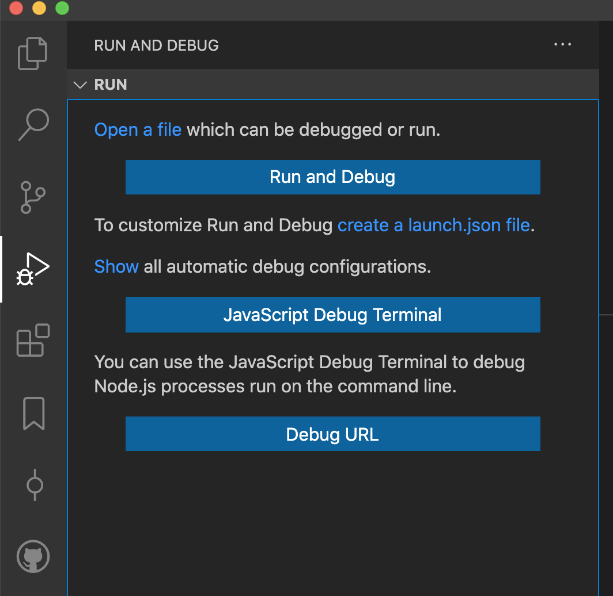

This project is licensed under the terms of the MIT license.

# Tyler's VSCode Setup for JS Development

Hello! Welcome. These are the settings, keybindings, and extensions I use in VSCode. The following instructions tell you where to put the files on your own system. Once they are there, I encourage you to look into how to enable and use the built-in [Settings Sync](https://code.visualstudio.com/docs/editor/settings-sync) feature. This will enable you to keep your VSCode settings up to date and use them across devices.

## Table of Contents
 - [MacOS](#macos)
 - [Windows 10](#windows-10)
 - [Setting up Jest](#setting-up-jest)
 - [Final Recommendations](#final-recommendations)

## MacOS
You'll be able to add both `settings.json` and `keybindings.json` in this location:

```
~/Library/Application Support/Code/User/
```

You'll be able to add extensions directory to this location:

```
~/.vscode/extensions
```

## Windows 10
You'll be able to add both `settings.json` and `keybindings.json` in this location:

```
C:\Users\username\AppData\Roaming\Code\User
```

You'll be able to add extensions to this location:
```
C:\Users\username\.vscode\extensions
```

## Setting Up Jest
[Jest](https://marketplace.visualstudio.com/items?itemName=Orta.vscode-jest) might not be intuitive to set up depending on your project's structure. The reason why is that it needs to know where to run tests from. I've found that one workflow for accomplishing successful configuration is to do the following:

1. Install and enable the [Jest](https://marketplace.visualstudio.com/items?itemName=Orta.vscode-jest) extension if you have not already.
2. On Mac, `Shift + Command + D` will open up the Run and Debug sidebar. (You can always click the button as well.)

3. If you click the big blue "Run and Debug" button the extension will bring up a list of options. You need to select the type of config you want to use for your project. The Jest extension should be able to auto-identify options relevant to your open project, directory, or workspace. In my case I used "Jest: create-react-app (ejected)" this time because the app I'm working in used the Create React App project and it was ejected at one point.


This is what my particular `.vscode/launch.json` config file looks like:

```JSON
{
  "version": "0.2.0",
  "configurations": [
    {
      "type": "node",
      "name": "tylers-jest-ejected",
      "request": "launch",
      "program": "${workspaceFolder}/aem/react-app/scripts/test",
      "args": [
        "--env=jsdom",
        "--runInBand"
      ],
      "skipFiles": [
        "<node_internals>/**"
      ],
      "cwd": "${workspaceFolder}/aem/react-app",
      "console": "integratedTerminal",
      "internalConsoleOptions": "neverOpen",
      "disableOptimisticBPs": true
    }
  ]
}

```

## Final Recommendations

* [ ] Add `.vscode/` to your [Gitignore](https://github.com/github/gitignore) file.

Read up on these very helpful features of VSCode to maximize your health, happiness, and productivity.
* [ ] [Settings Sync](https://code.visualstudio.com/docs/editor/settings-sync)
* [ ] [Workspaces](https://code.visualstudio.com/docs/editor/workspaces)
* [ ] [Multi-root Workspaces](https://code.visualstudio.com/docs/editor/multi-root-workspaces)
* [ ] [Debugging](https://code.visualstudio.com/docs/editor/debugging)
